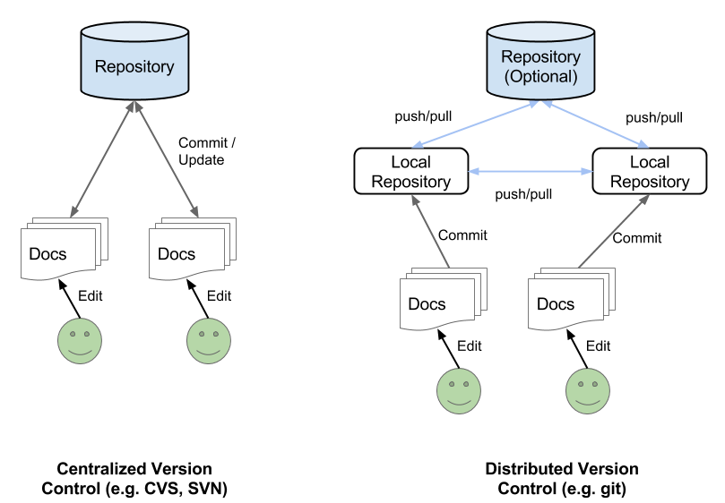

% git 101

# Version Control

## Collaborative Editing

### The problem
- One document, many editors
- How to allow editors to work in parallel?
- How to avoid overriding changes?
- How to keep track of changes?
- How to revert to previous versions of the document?

### The solution
- Version Control Systems!

## Architecture Of a Version Control System

# git

## About
<!-- # git -->

* git is an _implementation_ of a _distributed VC system_

* git provides:
    * server utilities
    * client utilities (command line, GUIs)

* git is widely used for open source development

* there are providers for free storage for public git repositories:
     * GitHub (the one we use)
     * Bitbucket
     * Google Code (?)

* a very good online resource -- http://git-scm.com/

<!-- # git -->

## Workflow

1. get a copy of the _remote_ repository
2. make some changes & check them
4. stage & commit changes - save your work _locally_
6. fetch _remote_ changes that took place in the meantime
7. integrate these changes with yours (can be automated)
8. send your version to the repository
9. done!

# git command line client

## Getting Started

### Getting Help

* To get help on git --- `git --help`

* To get help on a command --- `git help <command>`

* Most commands work only inside a git repository

### Copying remote repository

`git clone <path/to/repository>.git`

### Seeing your changes

`git status`

<!-- # git command line client -->

## Saving Changes Locally

### Staging your changes

`git add <path/to/changed/file>`

* Staging means __I am preparing to commit this work__

### Committing your work

`git commit -m <Useful message>`

* Commits all staged changes to your local repo
* Useful messages are helpful when reviewing change history

## Syncing your changes

`git pull -u <repo> <branch>`

* Means 'get all recent changes from repo and apply them to my local
  version'
* Often `<repo>` is origin, `<branch>` is master
* git can sometimes merge the local and remote versions automatically
* when this fails, the file is marked with `CONFLICT`
* when a file is marked with `CONFLICT` you need to edit it to ensure
  the correct version is selected (this may be tricky)
* when you are done, make a new commit -- you are now up to date
  (unless someone else just made some more changes...)

<!-- # git command line client -->

## Push & Check

### Uploading your local copy

`git push -u <repo> <branch>`

* Pushes your changes to repo on branch
* You must have done a `pull` beforehand

### Viewing the change history

`git log`

* shows a history of local changes

# Demo Time!
